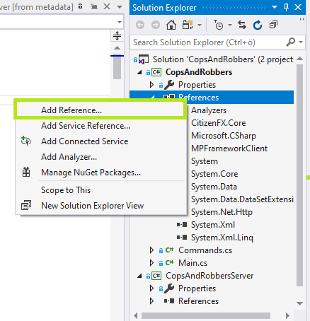

# Instructions #

This framework is meant for Grand Theft Auto: V multiplayer platforms. Currently it is made for FiveM platform, but can be easily port to whatever GTA:V platform by changing some namespaces and classes. This resource only works with C# based gamemodes.  
     
Framework has about 100 callbacks in client- and serverside which can be used to make your main gamemode more stable and structured.  
  
This project is currently work in progress and if you have any suggestions then be welcome to let me know.

## Usage / Installation ##

1. Download MPFrameworkClient.dll and MPFrameworkServer.dll  
2. In your client resource add *PreBuiltDLLs/MPFrameworkClient.dll* as reference in Visual Studio  
3. In your server resource add *PreBuiltDLLs/MPFrameworkServer.dll* as reference in Visual Studio  
  
4. In your client resource's Main class add using
```csharp
using MPFrameworkClient;

namespace CopsAndRobbers
{
    public class Main : BaseScript
    {
        ClientCore core = new ClientCore();

        public Main()
        {
            core.OnPlayerSpawned += OnPlayerSpawned;
            /* ... */
        }

        public void OnPlayerSpawned(int newPedHandle, int newPedNetworkId, float x, float y, float z)
        {
            Debug.WriteLine("CNR: OnPlayerSpawned NEW PED ID " + ClientCore.PedHandle);
        }

        [Tick]
        async Task OnTickMain()
        {
            await core.Process();
        }
    }
}
```
5. In your server resource's Main class add using
```csharp
using MPFrameworkServer;

namespace CopsAndRobbersServer
{
    public class Main : BaseScript
    {
        public Main()
        {
            ServerCore.OnPlayerSpawned += OnPlayerSpawned;
            /* ... Your code here ... */
        }

        public void OnPlayerSpawned(Player client)
        {
            Debug.WriteLine("CNR OnPlayerSpawned " + client.Handle);
            /* ... Your code here ... */
        }
    }
}
```
6. Configure your server (for example fxmanifest.lua) something like this:  
```json
fx_version 'adamant'

game 'gta5'
description 'Some Server Name Here'
author 'Caupo Helvik'
version '0.1'

files {
    'dlls/MPFrameworkServer.dll',
    'dlls/MPEventFramework.dll'
}

client_scripts {
    'client/CopsAndRobbers.net.dll'
}

server_scripts {
    'server/CopsAndRobbersServer.net.dll'
}
```

7. Build & run your gameserver.

## Events clientside ##

<details>
  <summary>Click to open clientside callbacks</summary>

```csharp

OnPlayerStartedBurnouting(int vehicleHandle);
OnPlayerStoppedBurnouting(int vehicleHandle);
OnPlayerStartedMovingVehicle(int vehicleHandle);
OnPlayerStoppedVehicle(int vehicleHandle);
OnPlayerStartedJumpingOutOfVehicle(int vehicleHandle, int vehicleSeat);
OnPlayerStoppedJumpingOutOfVehicle(int vehicleHandle, int vehicleSeat);
OnPlayerTryingToEnterVehicle(int vehicleHandle, int vehicleSeat);
OnPlayerEnteredVehicle(int vehicleHandle, int vehicleSeat);
OnPlayerLeaveVehicle(int vehicleHandle, int vehicleSeat);
OnPlayerSeatChange(int vehicleHandle, int vehicleSeat);
OnPlayerSpawnIntoVehicle(int vehicleHandle);
OnPlayerEnteredBoat(int vehicleHandle, int vehicleSeat);
OnPlayerLeftBoat(int vehicleHandle, int vehicleSeat);
OnPlayerEnteredHeli(int vehicleHandle, int vehicleSeat);
OnPlayerLeftHeli(int vehicleHandle, int vehicleSeat);
OnPlayerEnteredPlane(int vehicleHandle, int vehicleSeat);
OnPlayerLeftPlane(int vehicleHandle, int vehicleSeat);
OnPlayerEnteredPoliceVehicle(int vehicleHandle, int vehicleSeat);
OnPlayerLeftPoliceVehicle(int vehicleHandle, int vehicleSeat);
OnPlayerEnteredSub(int vehicleHandle);
OnPlayerLeftSub(int vehicleHandle);
OnPlayerEnteredTaxi(int vehicleHandle, int vehicleSeat);
OnPlayerLeftTaxi(int vehicleHandle, int vehicleSeat);
OnPlayerEnteredTrain(int vehicleHandle, int vehicleSeat);
OnPlayerLeftTrain(int vehicleHandle, int vehicleSeat);
OnPlayerEnteredFlyingVehicle(int vehicleHandle, int vehicleSeat);
OnPlayerLeftFlyingVehicle(int vehicleHandle, int vehicleSeat);
OnPlayerStartedOnBike(int vehicleHandle, int vehicleSeat);
OnPlayerStoppedOnBike(int vehicleHandle, int vehicleSeat);
OnPlayerStartedOnVehicle();
OnPlayerStoppedOnVehicle();
OnVehicleHealthGain(int vehicleHandle, int vehicleHealth, float vehicleBodyHealth, float vehicleEngineHealth, float vehiclePetrolTankHealth);
OnVehicleHealthLoss(int vehicleHandle, int vehicleHealth, float vehicleBodyHealth, float vehicleEngineHealth, float vehiclePetrolTankHealth);
OnVehicleCrash(int vehicleHandle);
OnPlayerStartedAiming(uint weapon);
OnPlayerStoppedAiming(uint weapon);
OnPlayerReadyToShoot(uint weapon);
OnPlayerNotReadyToShoot();
OnPlayerEnteredMainMenu();
OnPlayerLeftMainMenu();
OnPlayerStartedWearingHelmet();
OnPlayerStoppedWearingHelmet();
OnPlayerStartedVaulting();
OnPlayerStoppedVaulting();
OnPlayerStartedStealthKill(uint weapon);
OnPlayerStoppedStealthKill(uint weapon);
OnPlayerStartedSwimmingUnderwater();
OnPlayerStoppedSwimmingUnderwater();
OnPlayerStartedSwimming();
OnPlayerStoppedSwimming();
OnPlayerStartedShooting(uint weapon, int ammo);
OnPlayerStoppedShooting(uint weapon, int ammo);
OnPlayerStartedWalking();
OnPlayerStoppedWalking();
OnPlayerSpawned(int newPedHandle, int newPedNetworkId, float x, float y, float z);
OnPlayerStartedReloading(uint weapon);
OnPlayerStoppedReloading(uint weapon);
OnPlayerStartedRunning();
OnPlayerStoppedRunning();
OnPlayerStartedSprinting();
OnPlayerStoppedSprinting();
OnPlayerStartedJumping();
OnPlayerStoppedJumping();
OnPlayerCuffed();
OnPlayerUnCuffed();
OnPlayerStartedToGetUp();
OnPlayerStoppedToGetUp();
OnPlayerStartedToAimFromCover(uint weapon);
OnPlayerStoppedToAimFromCover(uint weapon);
OnPlayerStartedGettingJacked();
OnPlayerStoppedGettingJacked();
OnPlayerStartedGettingStunned();
OnPlayerStoppedGettingStunned();
OnPlayerStartedClimbing();
OnPlayerStoppedClimbing();
OnPlayerDied(float x, float y, float z);
OnPlayerRevived(float x, float y, float z);
OnPlayerStartedDiving();
OnPlayerStoppedDiving();
OnPlayerStartedDriveBy(int vehicleHandle, uint weapon);
OnPlayerStoppedDriveBy(int vehicleHandle, uint weapon);
OnPlayerStartedFalling();
OnPlayerStoppedFalling();
OnPlayerStartedOnFoot();
OnPlayerStoppedOnFoot();
OnPlayerEnteredMeleeCombat();
OnPlayerLeftMeleeCombat();
OnPlayerEnteredCover();
OnPlayerLeftCover();
OnPlayerEnteredParachuteFreefall();
OnPlayerLeftParachuteFreefall();
OnPlayerStartedJacking();
OnPlayerStoppedJacking();
OnPlayerHealthGain(int oldHealth, int newHealth);
OnPlayerHealthLoss(int oldHealth, int newHealth);
OnPlayerArmourGain(int oldArmour, int newArmour);
OnPlayerArmourLoss(int oldArmour, int newArmour);
OnPlayerWeaponChange(uint oldWeapon, uint newWeapon);
OnSecondPassed();
OnHundredMilliSecondPassed();
OnMinutePassed();
OnHourPassed();
OnKeyPressed(int key);
OnKeyReleased(int key);
```
</details>

## Events serverside ##

<details>
  <summary>Click to open serverside callbacks</summary>

```csharp
OnPlayerStartedBurnouting(Player player, int vehicleNetworkId);
OnPlayerStoppedBurnouting(Player player, int vehicleNetworkId);
OnPlayerStartedMovingVehicle(Player player, int vehicleNetworkId);
OnPlayerStoppedVehicle(Player player, int vehicleNetworkId);
OnPlayerStartedJumpingOutOfVehicle(Player player, int vehicleNetworkId, int vehicleSeat);
OnPlayerStoppedJumpingOutOfVehicle(Player player, int vehicleNetworkId, int vehicleSeat);
OnPlayerTryingToEnterVehicle(Player player, int vehicleNetworkId, int vehicleSeat);
OnPlayerEnteredVehicle(Player player, int vehicleNetworkId, int vehicleSeat);
OnPlayerLeaveVehicle(Player player, int vehicleNetworkId, int vehicleSeat);
OnPlayerSeatChange(Player player, int vehicleNetworkId, int vehicleSeat);
OnPlayerSpawnIntoVehicle(Player player, int vehicleNetworkId, int vehicleSeat);
OnPlayerEnteredBoat(Player player, int vehicleNetworkId, int vehicleSeat);
OnPlayerLeftBoat(Player player, int vehicleNetworkId, int vehicleSeat);
OnPlayerEnteredHeli(Player player, int vehicleNetworkId, int vehicleSeat);
OnPlayerLeftHeli(Player player, int vehicleNetworkId, int vehicleSeat);
OnPlayerEnteredPlane(Player player, int vehicleNetworkId, int vehicleSeat);
OnPlayerLeftPlane(Player player, int vehicleNetworkId, int vehicleSeat);
OnPlayerEnteredPoliceVehicle(Player player, int vehicleNetworkId, int vehicleSeat);
OnPlayerLeftPoliceVehicle(Player player, int vehicleNetworkId, int vehicleSeat);
OnPlayerEnteredSub(Player player, int vehicleNetworkId, int vehicleSeat);
OnPlayerLeftSub(Player player, int vehicleNetworkId, int vehicleSeat);
OnPlayerEnteredTaxi(Player player, int vehicleNetworkId, int vehicleSeat);
OnPlayerLeftTaxi(Player player, int vehicleNetworkId, int vehicleSeat);
OnPlayerEnteredTrain(Player player, int vehicleNetworkId, int vehicleSeat);
OnPlayerLeftTrain(Player player, int vehicleNetworkId, int vehicleSeat);
OnPlayerEnteredFlyingVehicle(Player player, int vehicleNetworkId, int vehicleSeat);
OnPlayerLeftFlyingVehicle(Player player, int vehicleNetworkId, int vehicleSeat);
OnPlayerStartedOnBike(Player player, int vehicleNetworkId, int vehicleSeat);
OnPlayerStoppedOnBike(Player player, int vehicleNetworkId, int vehicleSeat);
OnPlayerStartedOnVehicle(Player player);
OnPlayerStoppedOnVehicle(Player player);
OnVehicleHealthGain(Player player, int vehicleNetworkId, int vehicleHealth, float vehicleBodyHealth, float vehicleEngineHealth, float vehiclePetrolTankHealth);
OnVehicleHealthLoss(Player player, int vehicleNetworkId, int vehicleHealth, float vehicleBodyHealth, float vehicleEngineHealth, float vehiclePetrolTankHealth);
OnVehicleCrash(Player player, int vehicleNetworkId);
OnPlayerStartedAiming(Player player, uint weapon);
OnPlayerStoppedAiming(Player player, uint weapon);
OnPlayerReadyToShoot(Player player, uint weapon);
OnPlayerNotReadyToShoot(Player player);
OnPlayerEnteredMainMenu(Player player);
OnPlayerLeftMainMenu(Player player);
OnPlayerStartedWearingHelmet(Player player);
OnPlayerStoppedWearingHelmet(Player player);
OnPlayerStartedVaulting(Player player);
OnPlayerStoppedVaulting(Player player);
OnPlayerStartedStealthKill(Player player, uint weapon);
OnPlayerStoppedStealthKill(Player player, uint weapon);
OnPlayerStartedSwimmingUnderwater(Player player);
OnPlayerStoppedSwimmingUnderwater(Player player);
OnPlayerStartedSwimming(Player player);
OnPlayerStoppedSwimming(Player player);
OnPlayerStartedShooting(Player player, uint weapon);
OnPlayerStoppedShooting(Player player, uint weapon);
OnPlayerStartedWalking(Player player);
OnPlayerStoppedWalking(Player player);
OnPlayerSpawned(Player player);
OnPlayerStartedReloading(Player player, uint weapon);
OnPlayerStoppedReloading(Player player, uint weapon);
OnPlayerStartedRunning(Player player);
OnPlayerStoppedRunning(Player player);
OnPlayerStartedSprinting(Player player);
OnPlayerStoppedSprinting(Player player);
OnPlayerStartedJumping(Player player);
OnPlayerStoppedJumping(Player player);
OnPlayerCuffed(Player player);
OnPlayerUnCuffed(Player player);
OnPlayerStartedToGetUp(Player player);
OnPlayerStoppedToGetUp(Player player);
OnPlayerStartedToAimFromCover(Player player, uint weapon);
OnPlayerStoppedToAimFromCover(Player player, uint weapon);
OnPlayerStartedGettingJacked(Player player);
OnPlayerStoppedGettingJacked(Player player);
OnPlayerStartedGettingStunned(Player player);
OnPlayerStoppedGettingStunned(Player player);
OnPlayerStartedClimbing(Player player);
OnPlayerStoppedClimbing(Player player);
OnPlayerDied(Player player, float x, float y, float z);
OnPlayerRevived(Player player, float x, float y, float z);
OnPlayerStartedDiving(Player player);
OnPlayerStoppedDiving(Player player);
OnPlayerStartedDriveBy(Player player, uint weapon);
OnPlayerStoppedDriveBy(Player player, uint weapon);
OnPlayerStartedFalling(Player player);
OnPlayerStoppedFalling(Player player);
OnPlayerStartedOnFoot(Player player);
OnPlayerStoppedOnFoot(Player player);
OnPlayerEnteredMeleeCombat(Player player, uint weapon);
OnPlayerLeftMeleeCombat(Player player, uint weapon);
OnPlayerEnteredCover(Player player);
OnPlayerLeftCover(Player player);
OnPlayerEnteredParachuteFreefall(Player player);
OnPlayerLeftParachuteFreefall(Player player);
OnPlayerStartedJacking(Player player);
OnPlayerStoppedJacking(Player player);
OnPlayerHealthGain(Player player, int oldHealth, int newHealth);
OnPlayerHealthLoss(Player player, int oldHealth, int newHealth);
OnPlayerArmourGain(Player player, int oldArmour, int newArmour);
OnPlayerArmourLoss(Player player, int oldArmour, int newArmour);
OnPlayerWeaponChange(Player player, uint oldWeapon, uint newWeapon);
```
</details>

### Contribution guidelines ###

* All kinds of suggestions for changes and further developments
* Donations to https://www.paypal.com/donate?hosted_button_id=JRK6N2NR5FUD4

Created by Caupo Helvik (https://caupo.ee)

## NB: This framework is not tested with OneSync! ##
